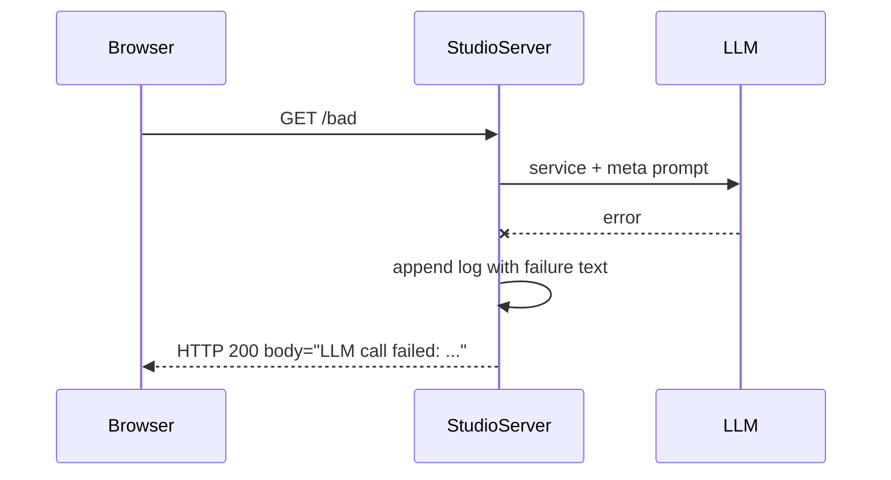
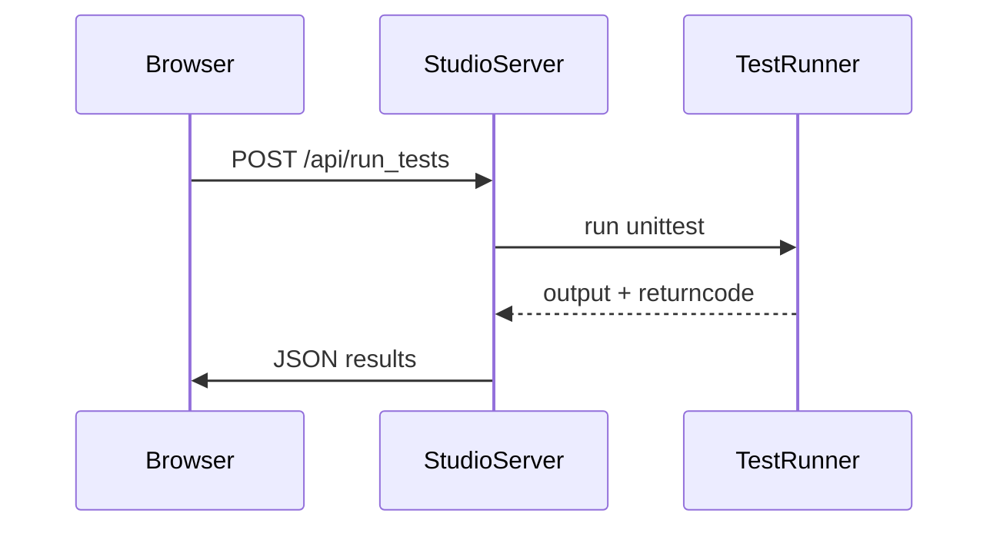
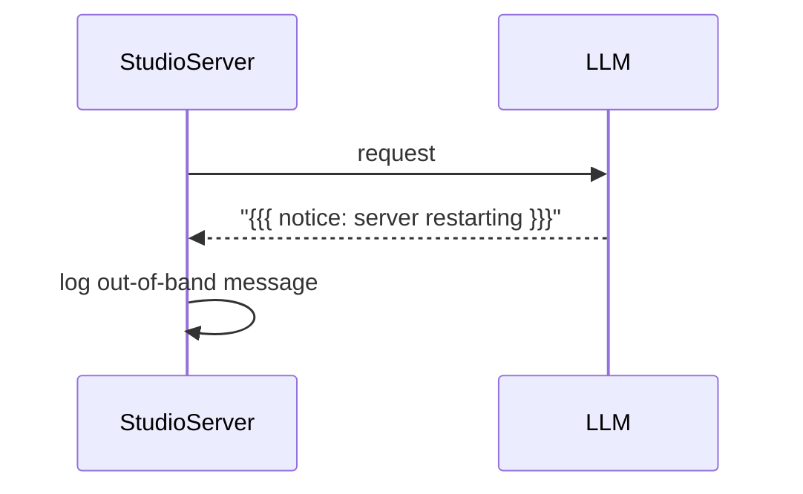

# VibeStudio Interactions

This document describes how to use the dashboard controls. The Service Prompt panel features a dropdown labelled `prompt-chooser` populated from `/api/examples`. Selecting an example fills the Service Prompt textarea with that example's prompt, making it easy to try different setups.

Other panels continue to function as outlined in `vibestudio_design.md`: you can edit prompts, restart the server, view traffic, and run tests from the Tester panel.

# VibeStudio Interaction Scenarios

This page illustrates several request flows through VibeStudio. The diagrams use mermaid syntax and
expand on the design described in [vibestudio_design.md](vibestudio_design.md).

## Failed LLM Request

When the language model call fails the error text is still returned to the client
and a log entry captures the failure.



## Tester Panel (`/api/run_tests`)

The Tester panel triggers the unit tests via the studio backend. Results propagate
back to the UI once the subprocess finishes.



## Out-of-Band Messages

The LLM may occasionally send notifications outside of normal HTTP responses.
These messages are wrapped in triple braces and logged.



## Example of Meta Prompt Wrapping

Below is a simplified HTTP exchange showing how the meta prompt appears in the
LLM response.

```
GET / HTTP/1.1
Host: localhost:8000
```

The studio server forwards the request with the active Service and Meta prompts.
A typical reply might be:

```
HTTP/1.1 200 OK
Content-Type: text/plain

{{{ You are a VibeServer controller... }}}
Hello world
```

The line wrapped in triple braces is the meta prompt returned verbatim so the
client can parse it separately from the rest of the body.

# VibeStudio Message Flow

This document expands on the existing design notes by walking through how a developer interacts with a VibeServer via VibeStudio. It combines a text-based UI mockup with message trace diagrams showing the flow between the browser, the local VibeStudio backend, and the remote LLM acting as the VibeServer.

## Components

* **VibeStudio Frontend** – Runs in the developer's browser and displays the dashboard panels.
* **VibeStudio Backend** – A lightweight Python server (`vibestudio/studio.py`) that serves the frontend assets, stores prompts, proxies HTTP traffic, and exposes helper APIs.
* **VibeServer (LLM)** – The language model that interprets HTTP requests and returns HTTP responses. The current implementation uses the OpenAI API.

## Initial creation

1. The developer starts the dashboard with `python -m vibestudio.studio`.
2. The backend loads `prompt.txt` and `meta_prompt.txt`, then launches an example HTTP server on port 8000.
3. The browser loads `http://localhost:8500/` and renders the panels.
4. When *Restart Server* is pressed, the backend combines the Service and Meta prompts and sends an initial `GET /` request to the LLM. The response populates the Browser panel.

Sequence diagram for the restart flow:

```
Browser -> Backend: POST /api/restart (prompts)
Backend -> LLM: meta + service prompt + "GET /" request
LLM -> Backend: HTTP response
Backend -> Browser: update traffic log
Browser -> Browser: iframe loads http://localhost:8000/
```

## Subsequent interactions

After the server is restarted, the Browser panel acts as a regular client. Each navigation or form submission is proxied through the backend to the LLM. Traffic logs show the requests and responses in real time.

```
Browser -> Backend: HTTP request via iframe
Backend -> LLM: same request prefixed with meta prompt
LLM -> Backend: HTTP response
Backend -> Browser: relay response and append log entry
```

Because the meta prompt instructs the model to act as a VibeServer, the LLM returns full HTTP replies beginning with the meta block wrapped in triple braces:

```
{{{ meta }}}
HTTP/1.1 200 OK
Content-Type: text/html

<html>...</html>
```

## Logging and out‑of‑band messages

The backend keeps an in‑memory list `LOGS` containing dictionaries with `request`, `status`, and `response` fields. The Traffic panel polls `/api/logs` every few seconds to display these entries. Meta messages wrapped in triple braces are parsed into a separate `META_LOGS` list so they can be shown in the new Meta Chat panel, indicating the direction of each message.

Future versions may allow the LLM to send notifications separate from the HTTP response stream. These would travel through the backend before reaching the UI.

## UI mockup

A simplified text representation of the dashboard:

```
+---------------- Service Prompt ----------------+
| [textarea]                                      |
| [Save]                                          |
+------------------------------------------------+

+----------------- Meta Prompt ------------------+
| [textarea]                                      |
| [Save] [Restart Server]                         |
+------------------------------------------------+

+------------------ Traffic ---------------------+
| GET / -> {{{ meta }}} HTTP/1.1 200 OK ...       |
| /form -> {{{ meta }}} HTTP/1.1 200 OK ...       |
+------------------------------------------------+

+------------------ Browser ---------------------+
| [ iframe showing http://localhost:8000/ ]       |
+------------------------------------------------+

+------------------- Tester ---------------------+
| [Run Tests]                                     |
| test output                                     |
+------------------------------------------------+
```

## Summary

VibeStudio orchestrates a short feedback loop between prompt editing, server restart, and live interaction. The backend threads together the service prompt, meta prompt, and user HTTP requests before calling the LLM. Responses are logged and displayed so the developer can iterate quickly on the behaviour of the VibeServer.

