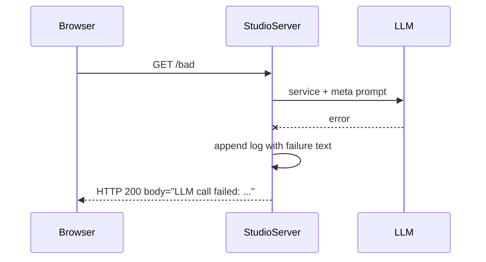
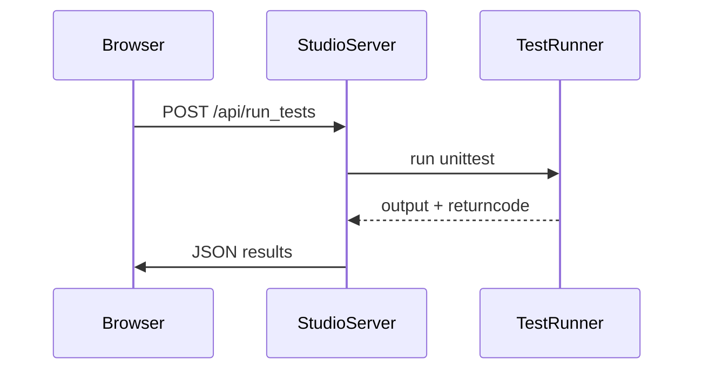
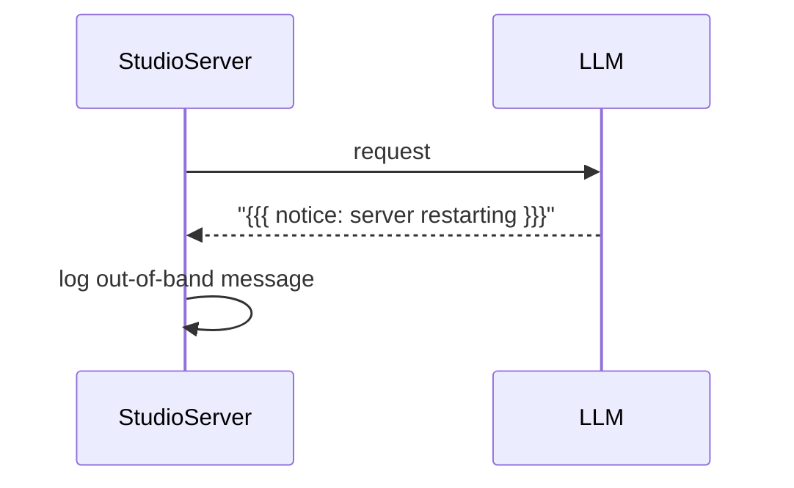

# VibeStudio Interaction Scenarios

This page illustrates several request flows through VibeStudio. The diagrams use mermaid syntax and
expand on the design described in [vibestudio_design.md](vibestudio_design.md).

## Failed LLM Request

When the language model call fails the error text is still returned to the client
and a log entry captures the failure.



## Tester Panel (`/api/run_tests`)

The Tester panel triggers the unit tests via the studio backend. Results propagate
back to the UI once the subprocess finishes.



## Out-of-Band Messages

The LLM may occasionally send notifications outside of normal HTTP responses.
These messages are wrapped in triple braces and logged.



## Example of Meta Prompt Wrapping

Below is a simplified HTTP exchange showing how the meta prompt appears in the
LLM response.

```
GET / HTTP/1.1
Host: localhost:8000
```

The studio server forwards the request with the active Service and Meta prompts.
A typical reply might be:

```
HTTP/1.1 200 OK
Content-Type: text/plain

{{{ You are a VibeServer controller... }}}
Hello world
```

The line wrapped in triple braces is the meta prompt returned verbatim so the
client can parse it separately from the rest of the body.
